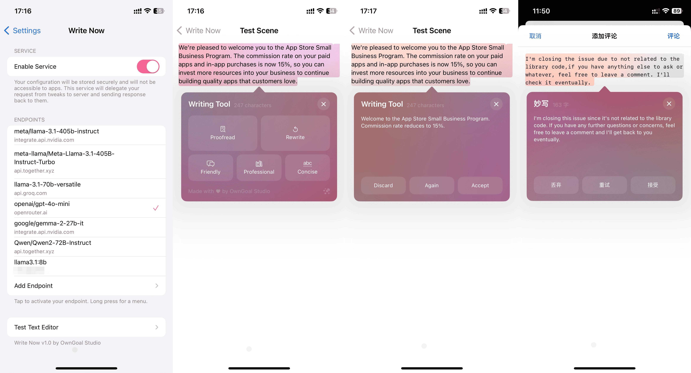

# Write Now

**Elevate Your Writing with Just a Click**

[简体中文](./Resources/i18n/zh-Hans/README.md)

Transform your text in an instant with Write Now, your all-in-one writing assistant. Whether you’re crafting a message, editing a document, or refining your next masterpiece, Write Now ensures your words leave the impact you desire—all while prioritizing your privacy.

## Key Features:

We have optimized all our prompts to function effectively across various models. Here are the key features of Write Now:

- **Proofread**  
  Ensure your text is polished and error-free. Our Proofread tool scans your content for grammar, spelling, and style issues, providing instant suggestions to elevate your writing.

- **Rewrite**  
  Need a fresh take? The Rewrite feature intelligently rephrases your text while maintaining its original meaning, helping you find the perfect expression for every idea.

- **Friendly Tone**  
  Make your writing more approachable and warm with the Friendly mode. Perfect for casual emails, social media posts, or any communication where a personal touch is key.

- **Professional Tone**  
  When you need to be concise and formal, the Professional mode has you covered. It adjusts your text to a tone that’s ideal for business, academic, or technical writing.

- **Concise Mode**  
  Cut through the clutter with the Concise tool, designed to trim unnecessary words and make your message as clear and direct as possible.

- **Custom AI Server Configuration**  
  Your privacy is our top priority. Write Now supports custom AI server configurations, ensuring that your data remains entirely private and secure. With this feature, you can use the AI on your own server, keeping your writing process free from any data collection.

## User Guide

### Installation

To utilize Write Now with your iOS devices, it is necessary to have the Dopamine jailbreak installed. If you have not yet installed Dopamine, please follow the instructions provided [here](https://ios.cfw.guide/) to get started.

Once you have completed the jailbreak setup, add the [Havoc Repo](https://havoc.app/) to Sileo and sign in to the repository. After that, download and install Write Now. This process will register your device with Havoc for DRM verification.

### Setup Endpoints

To utilize the AI features, it is necessary to configure the AI server endpoints. You have the option to use endpoints from OpenAI API providers or host your own AI server.

#### OpenAI API Providers

We recommend the following OpenAI API providers. After obtaining the key, please fill in the endpoint and key fields in the settings and select a model to get started. Most of the providers offer a generous quota for your personal use.

- [OpenAI](https://platform.openai.com/)

  - Endpoint: `https://api.openai.com/`
  - Get key from [here](https://platform.openai.com/api-keys)

- [TogetherAI](https://api.together.xyz/)

  - Endpoint: `https://api.together.xyz/`
  - Get key from [here](https://api.together.ai/settings/api-keys)

- [OpenRouter](https://openrouter.ai/)
  - Endpoint: `https://openrouter.ai/api`
  - Get key from [here](https://openrouter.ai/settings/keys)
- [Groq](https://groq.com/)
  - Endpoint: `https://api.groq.com/openai/`
  - Get key from [here](https://console.groq.com/keys)
- [NVIDIA NIM](https://www.nvidia.com/en-us/ai/)
  - Endpoint: `https://integrate.api.nvidia.com`
  - Get key from [here](https://build.nvidia.com/explore/reasoning)

#### Self-Host AI Server

If you prefer to host your own AI server for enhanced privacy, consider the following OpenAI API implementations. Once you have set up the endpoint, it will be your responsibility to complete the remaining configurations.

- [ollama](https://ollama.com/)
- [xorbitsai/inference](https://github.com/xorbitsai/inference)

---

**Made with ♥ by OwnGoal Studio**
