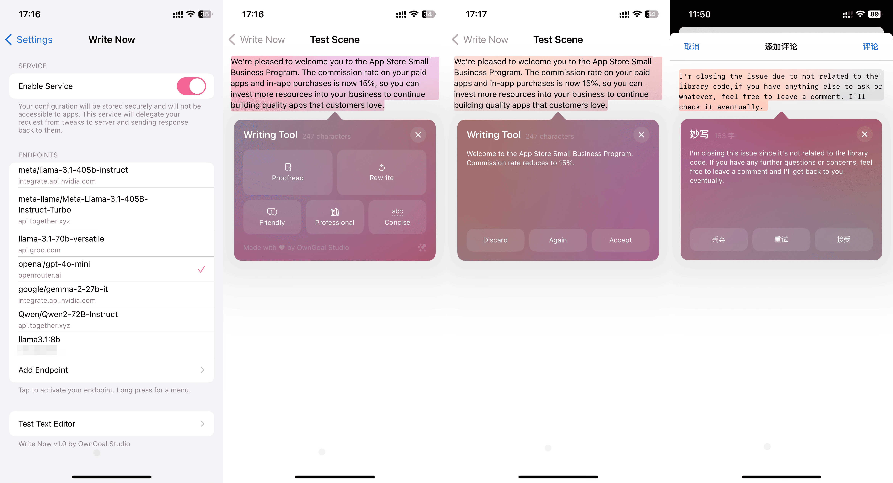

# 妙写

**多种语言，轻松对线！**

妙写是一个简单好用的写作助手，通过人工智能迅速优化表达。不论是编辑文档，还是在网上对线，妙写将帮助你修缮文本和表达，不露破绽。同时，妙写自身不收集用户数据，亦支持自部署的推理后台，可完整保护你的隐私。

## 主要功能：

我们优化了所有提示词，以确保它们在各种模型上都能有效运行。以下是妙写提供的主要功能。

**请注意，中文并非多数语言模型的首要训练语言。若希望获得更好的中文支持，建议使用专门训练的中文模型。**
**我们推荐使用 `command-r-plus` 或 `qwen2-72b-instruct` 作为中文首选模型**

- **校对**  
  协助你确保文本没有语法错误。妙写的校对工具会扫描内容中的语法、拼写和部分风格问题，并提供提修正。

- **重写**  
  需要新的表达方式？重写功能能够智能地重新措辞，在保持原意的基础上，帮助你找到最佳的表达方式。

- **友好语气**  
  通过友好模式让你的写作更加亲切自然，非常适合轻松的邮件、社交媒体帖子或任何需要个人化表达的场合。

- **专业语气**  
  当你需要正式且简洁的表达时，专业模式是你的理想选择。它会将你的文字调整为适合商务、学术或技术写作的语气。

- **简洁模式**  
  使用简洁工具，去除冗余词汇，使信息更加清晰明。

- **自定义推理服务器配置**  
  妙写将隐私保护放在首位。它支持自定义的推理服务器配置。如果你自行搭建推理后台，你的数据将完全保密。

## 用户指南

### 安装

要在 iOS 设备上使用妙写，你需要先安装 Dopamine 越狱工具。如果还未安装，请按照[此处](https://ios.cfw.guide/)的说明进行操作。

完成越狱后，添加 [Havoc Repo](https://havoc.app/) 到 Sileo 并登录仓库，然后下载并安装妙写。请搜索 Write Now。此过程将通过 DRM 验证注册你的设备。

### 设置端点

要使用 AI 功能，你需要配置 AI 服务器端点。你可以选择使用 OpenAI API 提供商的端点，或自行托管 AI 服务器。

#### OpenAI API 提供商

我们推荐以下 OpenAI API 提供商。获取密钥后，请在设置中填写端点和密钥字段，并选择一个模型开始使用。大多数提供商都为个人使用提供了充足的配额。

- [OpenAI](https://platform.openai.com/)

  - 端点: `https://api.openai.com/`
  - 获取密钥: [点击这里](https://platform.openai.com/api-keys)

- [TogetherAI](https://api.together.xyz/)

  - 端点: `https://api.together.xyz/`
  - 获取密钥: [点击这里](https://api.together.ai/settings/api-keys)

- [OpenRouter](https://openrouter.ai/)

  - 端点: `https://openrouter.ai/api`
  - 获取密钥: [点击这里](https://openrouter.ai/settings/keys)

- [Groq](https://groq.com/)

  - 端点: `https://api.groq.com/openai/`
  - 获取密钥: [点击这里](https://console.groq.com/keys)

- [NVIDIA NIM](https://www.nvidia.com/en-us/ai/)
  - 端点: `https://integrate.api.nvidia.com`
  - 获取密钥: [点击这里](https://build.nvidia.com/explore/reasoning)

- [GitHub Models](https://github.com/marketplace/models)
  - 端点: `https://models.inference.ai.azure.com`
  - 获取密钥: [点击这里](https://github.com/settings/tokens)

#### 自托管 AI 服务器

如果你更倾向于自行托管 AI 服务器，以进一步保护隐私，可以考虑以下 OpenAI API 实现。一旦设置了端点，你将负责完成后续配置。

- [ollama](https://ollama.com/)
- [xorbitsai/inference](https://github.com/xorbitsai/inference)

---

**OwnGoal Studio 巨献**
